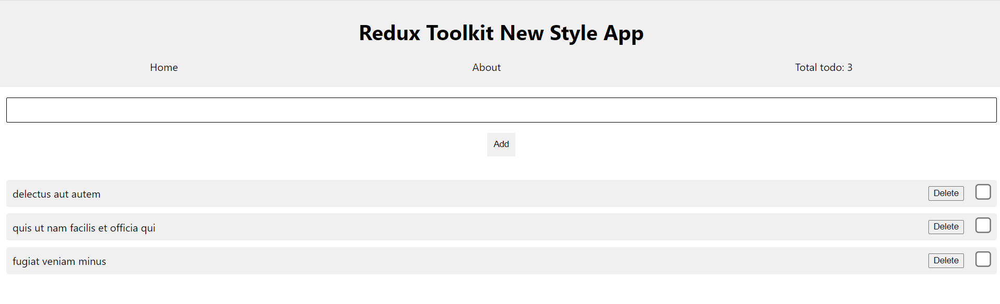
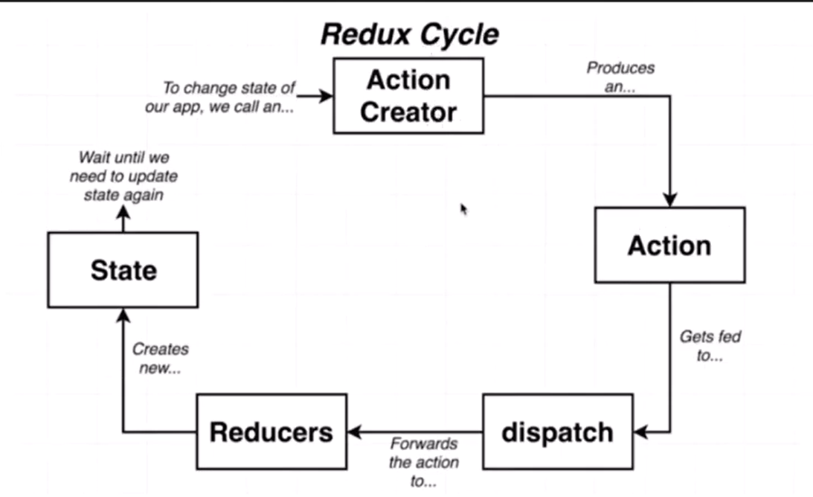

# Redux Toolkit New Style

Learn redux toolkit new style through todo app.

Live: [**https://redux-toolkit-new-style.netlify.app**](https://redux-toolkit-new-style.netlify.app)

## Environment

- Node 19.1.0

## Technologies Used

- react 18.2.x
- @reduxjs/toolkit 1.9.x
- react-redux 8.0.x

## Author

[**Trịnh Minh Nhật**](https://github.com/trinhminhnhat)

### Redux Data Flow

User -> action -> dispatch (type, payload) -> reducer (state management) base on type will update state -> render UI

- get state: use useSelector
- user action: use useDispatch

